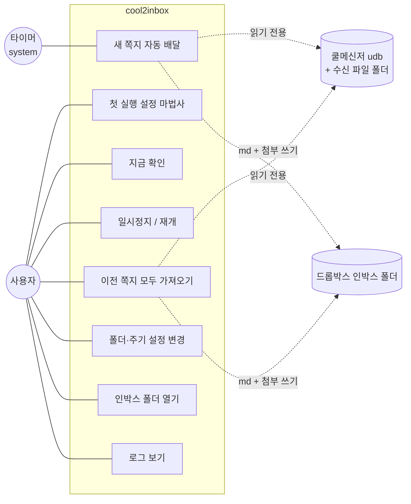
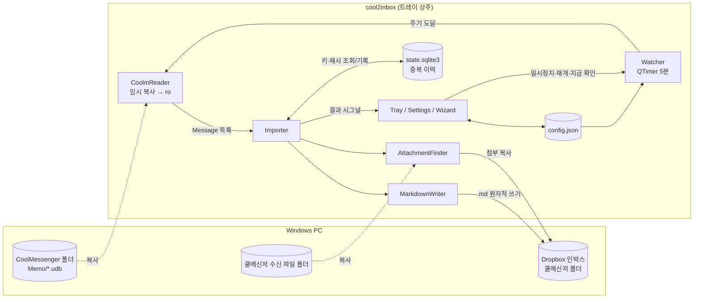
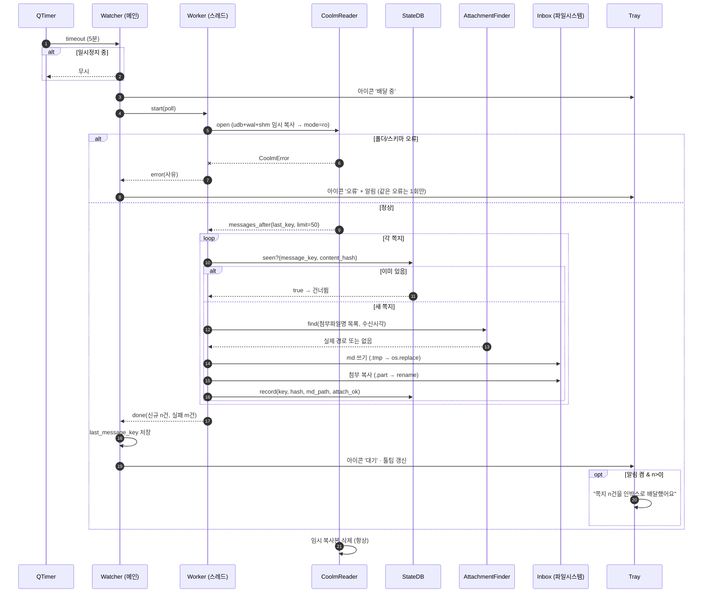
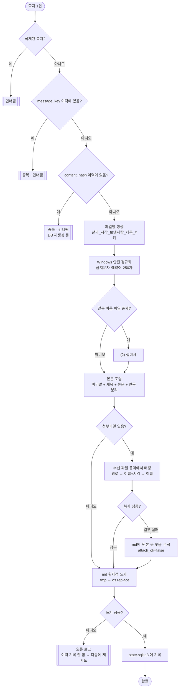
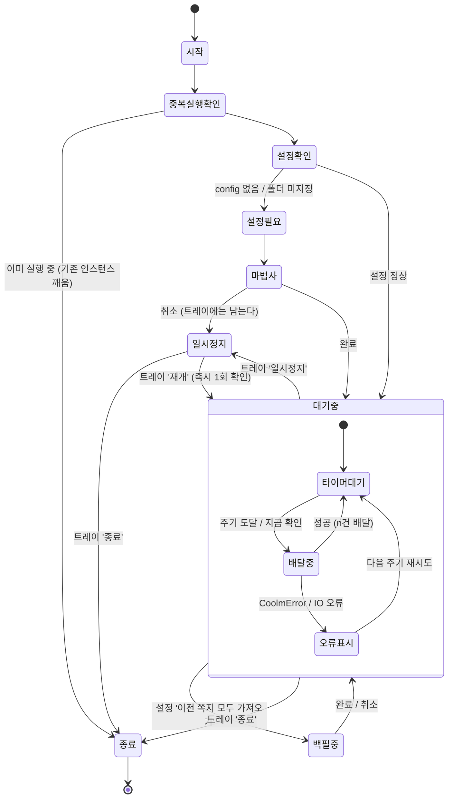
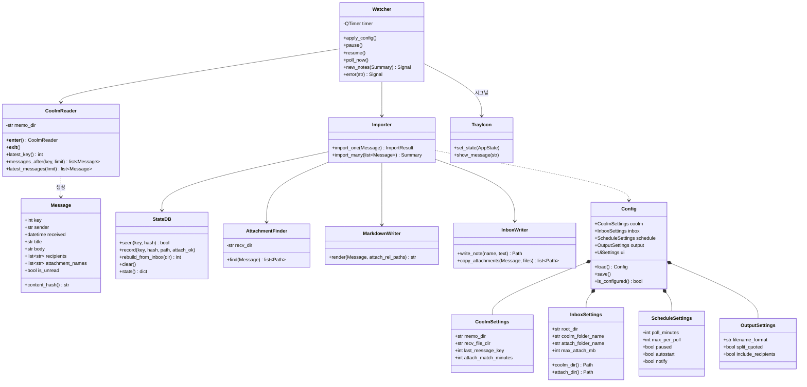
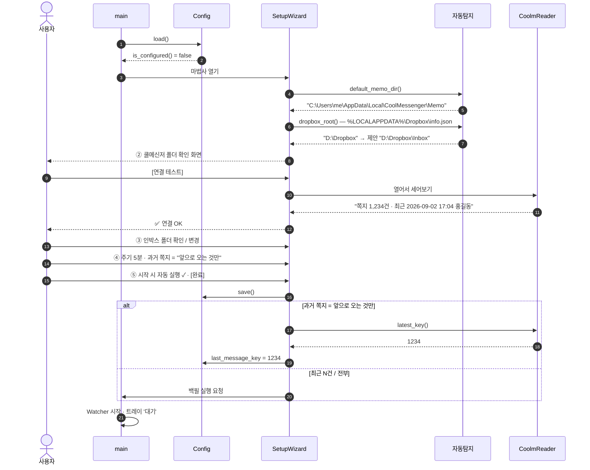
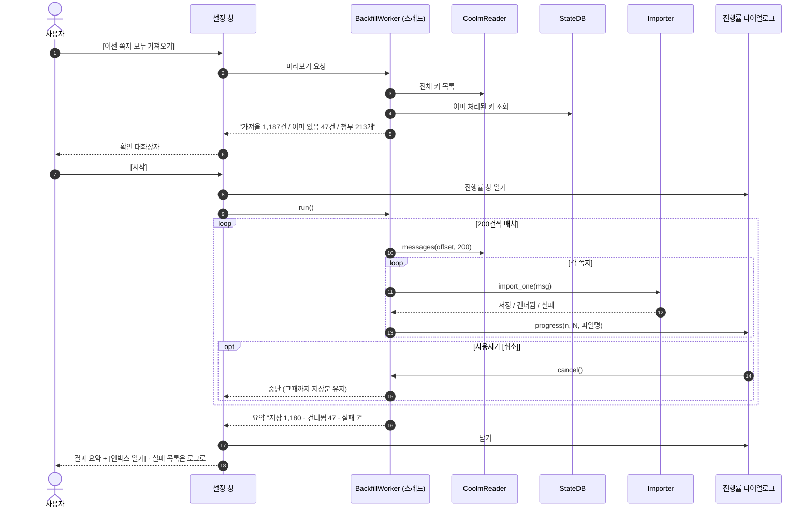

# cool2inbox PRD (Product Requirements Document)

버전 0.1 · 2026-09-02 · 작성 전 승인 대기 문서

> 쿨메신저 쪽지를 드롭박스 인박스에 **마크다운 1건 = 파일 1개**로 자동 적재하는 Windows 트레이 앱.
> 마스코트는 **펭귄 배달부**.

---

## 1. 개요

### 문제
쿨메신저로 오는 쪽지는 메신저 안에 갇혀 있다. 검색이 불편하고, 백업되지 않고,
다른 도구(옵시디언·에버노트·PARA 인박스·LLM)에서 쓰려면 매번 손으로 복사해야 한다.
첨부파일은 또 다른 폴더에 흩어져 어느 쪽지에 딸린 것인지 나중에 알 수 없다.
쿨메신저는 학교/기관 PC를 옮기면 과거 쪽지가 통째로 사라지기도 한다.

### 해결
**"펭귄이 쪽지를 인박스로 배달한다."**
트레이에 상주하는 작은 프로그램이 쿨메신저의 로컬 쪽지 DB를 주기적으로(기본 5분) 읽어
새 쪽지 1건을 마크다운 파일 1개로 만들어 드롭박스 인박스에 저장한다.
첨부파일은 쪽지별 하위 폴더로 함께 복사되고, 마크다운 본문에서 상대 링크로 연결된다.
드롭박스가 알아서 동기화하므로 사용자는 아무것도 하지 않는다.

### 목표 (측정 가능)
- 쪽지 수신 후 **최대 1회 폴링 주기(기본 5분) 안에** 인박스에 md 파일이 생긴다
- **중복 0건** — 몇 번을 다시 실행하거나 전체 가져오기를 눌러도 같은 쪽지가 두 번 저장되지 않는다
- **쿨메신저 원본에 대한 쓰기 0회** — 원본 DB·수신 파일은 절대 수정·삭제·이동하지 않는다
- 첫 실행 후 **설정 마법사 5단계 이내**로 사용 시작
- 상주 중 평상시 CPU 사용률 ~0% (폴링 순간 제외), 메모리 200MB 이하

### 비목표 (v1.0 범위 밖)
- 쪽지 **보내기**·답장 (읽기 전용 도구다)
- 보낸 쪽지 수집 → **v2.0**
- 드롭박스 API 연동 (로컬 동기화 폴더에 파일을 쓸 뿐, 드롭박스 계정에 접속하지 않는다)
- 쪽지 내용 요약·분류·LLM 처리 (그건 [catmoa](https://github.com/progh2/catmoa)가 한다)
- macOS·Linux 실사용 지원 (쿨메신저가 Windows 전용. 단 코드는 크로스 플랫폼으로 개발·테스트한다)

---

## 2. 사용자와 시나리오

**주 사용자:** 쿨메신저를 쓰는 학교·공공기관 직원. 기술 배경 없음. Windows 10/11.

| # | 시나리오 | 상황 | 기대 |
|---|---|---|---|
| S1 | 첫 실행 | 프로그램을 처음 켰다. 설정이 없다 | 마법사가 뜨고 쿨메신저 폴더·인박스 폴더를 자동 탐지해 보여준다. 확인만 누르면 끝 |
| S2 | 평소 | 트레이에 펭귄이 떠 있다. 쪽지가 왔다 | 5분 안에 인박스에 md 파일이 생긴다. 조용히. 알림은 설정으로 켤 수 있다 |
| S3 | 첨부파일 쪽지 | 협의회 자료 hwp가 붙은 쪽지 | md 파일 + `첨부파일/<쪽지폴더>/협의회자료.hwp` 가 함께 생기고 본문에서 링크로 열린다 |
| S4 | 과거 이력 이전 | 3년치 쪽지를 인박스로 옮기고 싶다 | 설정 → **이전 쪽지 모두 가져오기** → 진행률 표시 → 이미 있는 건 건너뜀 |
| S5 | 회의 중 | 잠깐 파일 생성이 멈췄으면 좋겠다 | 트레이 우클릭 → **일시정지**. 아이콘이 자는 펭귄으로 바뀜. 재개하면 밀린 쪽지를 한 번에 배달 |
| S6 | 폴더 변경 | 드롭박스 경로가 바뀌었다 | 설정에서 폴더 변경. 기존 파일은 건드리지 않고 앞으로 저장 위치만 바뀐다 |
| S7 | 쿨메신저 미설치 PC | 개발/테스트 PC | 폴더를 못 찾으면 오류가 아니라 안내를 띄우고, 사용자가 직접 지정할 수 있다 |

---

## 3. 기능 요구사항

### FR-1 쪽지 읽기 (소스)

| 코드 | 요구사항 |
|---|---|
| FR-1.1 | 쿨메신저 쪽지 저장소는 `%LOCALAPPDATA%\CoolMessenger\Memo\*.udb` — 암호화되지 않은 SQLite(WAL). 받은 쪽지는 `tbl_recv` 테이블 |
| FR-1.2 | **원본은 절대 쓰기 모드로 열지 않는다.** `.udb` + `-wal` + `-shm` 을 임시 폴더에 복사한 뒤 복사본을 `mode=ro` 로 연다. 사용 후 복사본 삭제 |
| FR-1.3 | 폴더 자동 탐지 — `LOCALAPPDATA`/`APPDATA`/`PROGRAMDATA`/`USERPROFILE` 아래 관례 경로와 계정별 하위 폴더를 훑는다. 후보에 **`Documents\CoolMessenger Files\Memo`(공백 포함)** 와 `CustomData*` 의 형제 폴더를 반드시 포함한다. 실패 시 사용자가 직접 지정 |
| FR-1.4 | **내용 기반 선택** — 파일명·폴더명으로 고르지 않는다. 후보 `.udb` 를 열어 **`tbl_recv` 를 가진 것**만 채택하고, 여럿이면 가장 최근 수정된 것을 쓴다. (설정 폴더에 `tbl_tabInfo` 짜리 동명 `.udb` 가 존재하므로 이름으로 고르면 잘못 잡는다 — [#6](../../issues/6) 실물 확인) |
| FR-1.5 | 스키마 검증 — `tbl_recv` 와 필수 컬럼(`MessageKey`, `Sender`, `ReceiveDate`, `Title`, `MessageText`, `ReferenceList`, `FilePath`)이 없으면 "쿨메신저 버전이 바뀌었을 수 있다"는 안내로 중단. 선택 컬럼(`DeletedDate`, `IsUnRead`, `CCList`, `MessageBody`)은 **있으면 쓰고 없으면 건너뛴다** |
| FR-1.6 | `DeletedDate` **컬럼은 확인한 DB에 없었다**(삭제 시 행 자체가 사라지는 것으로 보임). 컬럼이 있는 버전을 대비해 있으면 거르고, 없으면 그냥 진행한다 |
| FR-1.7 | `ReceiveDate` 형식 `2026/07/16 17:04:52 (목)` → `datetime` 파싱. 실패한 행은 건너뛰고 로그에 남긴다 |
| FR-1.8 | 수신자 목록 = `ReferenceList`(+`CCList`) 를 `\|` 로 분해해 **멤버키 → `tbl_member.MemberName`** 으로 변환. 조인 실패 시 `#<멤버키>` 로 폴백 (**R1 해소**, [#6](../../issues/6)) |
| FR-1.9 | 본문은 `MessageText`(평문)를 기본으로 쓴다. `MessageBody`(base64+zlib+UTF-16LE HTML)를 마크다운으로 변환하는 옵션은 v1 이후 검토 |
| FR-1.10 | 보낸 쪽지(`tbl_send`, 509건 확인)는 v1 범위 밖 |

### FR-2 첨부파일

| 코드 | 요구사항 |
|---|---|
| FR-2.1 | 쪽지에 딸린 **첨부파일명 목록**은 DB에서 읽어 md 머리말에 기록한다 |
| FR-2.2 | 실제 파일 바이트는 쿨메신저 **수신 파일 저장 폴더**에서 인박스로 **복사**한다. 원본은 이동·삭제하지 않는다 |
| FR-2.3 | 수신 파일 폴더 = **`%USERPROFILE%\Documents\CoolMessenger Files\Received Files\`** (실물 확인 완료). 하위 폴더 없이 **원본 파일명 그대로 평평하게** 쌓인다. 자동 탐지 후 설정에서 변경 가능 |
| FR-2.4 | 매칭 전략 (우선순위): ① **파일명 일치 + 바이트 크기 일치** (`FilePath` 가 개별 크기를 갖고 있다 — 실측에서 디스크 파일과 정확히 일치했다) → ② 파일명만 일치하는 것 중 수신 시각에 가장 가까운 것 → ③ 실패. 모두 실패하면 **파일명·크기만 기록**하고 md에 `첨부파일 원본을 찾지 못함` 주석을 남긴다 |
| FR-2.5 | 복사는 원자적으로 — `.part` 임시 파일에 쓴 뒤 rename. 드롭박스가 반쯤 쓰인 파일을 동기화하지 않게 한다 |
| FR-2.6 | 같은 쪽지 안에서 파일명이 겹치면 `이름 (2).ext` 로 회피 |
| FR-2.7 | 첨부 복사 실패(파일 잠김·권한·용량)는 **쪽지 저장 실패로 취급하지 않는다.** md는 저장하고 실패 사실을 md와 로그에 남긴 뒤 다음 폴링에서 재시도 |
| FR-2.8 | 설정에 **첨부 최대 크기**(기본 200MB, 0=무제한). 초과분은 건너뛰고 md에 사유 기록 |

### FR-3 인박스 출력

| 코드 | 요구사항 |
|---|---|
| FR-3.1 | 폴더 구조는 아래 [4.2 출력 레이아웃](#42-출력-레이아웃) 을 따른다. 필요한 폴더는 자동 생성 |
| FR-3.2 | **쪽지 1건 = md 파일 1개.** 확장자 `.md`, 인코딩 UTF-8(BOM 없음), 줄바꿈 `\n` |
| FR-3.3 | 파일명 기본 규칙: `YYYY-MM-DD_HHMM_보낸사람_제목_#키.md` (예: `2026-09-02_1704_홍길동_2학기_교육과정_협의회_#1234.md`) |
| FR-3.4 | 제목이 비어 있으면 **본문 첫 줄을 30자까지** 잘라 쓰고, 본문도 비어 있으면 `무제` |
| FR-3.5 | 파일명 정규화 — Windows 금지문자 `\ / : * ? " < > \|` 와 제어문자는 `_` 로, 연속 공백은 `_` 로, 앞뒤 공백·마침표 제거, 예약어(`CON`,`PRN`,`AUX`,`NUL`,`COM1..9`,`LPT1..9`) 회피, **전체 경로 250자 제한**(초과 시 제목 부분부터 자른다) |
| FR-3.6 | 파일명 서식은 설정에서 변경 가능 — 토큰 `{date}` `{time}` `{sender}` `{title}` `{key}` 조합. `{key}` 를 빼면 이름 충돌 시 자동으로 `(2)` 를 붙인다 |
| FR-3.7 | 쓰기는 원자적으로 — 같은 폴더의 `.tmp` 에 쓴 뒤 `os.replace`. 드롭박스 부분 동기화 방지 |
| FR-3.8 | 이미 같은 쪽지의 md가 있으면 **덮어쓰지 않는다** (FR-4 중복 방지) |

### FR-4 중복 방지

| 코드 | 요구사항 |
|---|---|
| FR-4.1 | 처리 이력은 설정 디렉터리의 `state.sqlite3` 에 저장: `imported(message_key PK, content_hash, md_path, imported_at, attach_ok)` |
| FR-4.2 | 1차 판정 = `message_key` (udb 내 고유). 2차 판정 = `content_hash` = `sha256(sender \| received \| title \| body)` — DB가 재생성돼 키가 초기화되는 경우 대비 |
| FR-4.3 | 3차 판정 = **출력 폴더 실사**. 상태 DB가 없거나 유실돼도, 인박스의 md 머리말에서 `message_key`/`content_hash` 를 읽어 이력을 재구축한다 (설정 → **인박스에서 이력 다시 읽기**) |
| FR-4.4 | 저장 성공 후에만 이력에 기록한다 (쓰다 만 파일이 "처리됨"으로 남지 않게) |
| FR-4.5 | 사용자가 인박스의 md를 지우면 다음 가져오기에서 **다시 만들지 않는다** (이력이 남아 있으므로). 다시 받으려면 설정 → **이력 초기화** |

### FR-5 폴링과 실행 제어

| 코드 | 요구사항 |
|---|---|
| FR-5.1 | `QTimer` 폴링. 기본 **5분**, 설정 범위 1~120분 |
| FR-5.2 | 트레이 메뉴 **일시정지 / 재개** — 일시정지 중에는 타이머를 멈추고 아이콘을 '자는 펭귄'으로 바꾼다. 재개하면 즉시 1회 확인 |
| FR-5.3 | 트레이 메뉴 **지금 확인** — 주기와 무관하게 즉시 1회 |
| FR-5.4 | DB 읽기·파일 쓰기는 **워커 스레드**에서. UI는 절대 멈추지 않는다. 워커에서 GUI를 직접 건드리지 않는다 (시그널/슬롯으로만) |
| FR-5.5 | 1회 폴링에서 처리할 최대 건수(기본 50)를 두고, 남으면 다음 주기에 이어서 처리한다 |
| FR-5.6 | 같은 오류가 반복되면 알림은 **처음 1회만**. 상태가 바뀌면 다시 알린다 |
| FR-5.7 | **중복 실행 방지** — 이미 떠 있으면 새 프로세스는 기존 창을 깨우고 종료 |
| FR-5.8 | 설정에 **Windows 시작 시 자동 실행** (레지스트리 `Run` 키) |

### FR-6 설정

| 코드 | 요구사항 |
|---|---|
| FR-6.1 | 설정은 JSON 파일 (`platformdirs` 사용자 설정 디렉터리). 환경변수 `COOL2INBOX_CONFIG_DIR` 로 위치 변경 가능(테스트·휴대용) |
| FR-6.2 | **폴더** 탭 — 쿨메신저 Memo 폴더 / 쿨메신저 수신 파일 폴더 / 인박스 루트 폴더 / 쿨메신저 폴더명(기본 `쿨메신저`) / 첨부파일 폴더명(기본 `첨부파일`). 각각 찾아보기 + **연결 테스트** 버튼 |
| FR-6.3 | **확인 주기** 탭 — 분 단위 스핀박스(기본 5), 1회 최대 처리 건수, 시작 시 자동 실행, 알림 표시 여부 |
| FR-6.4 | **출력 형식** 탭 — 파일명 서식, 머리말 포함 항목 체크박스, 인용된 이전 대화 분리 여부·길이, 첨부 최대 크기 |
| FR-6.5 | **가져오기** 탭 — `이전 쪽지 모두 가져오기`(FR-7), `인박스에서 이력 다시 읽기`, `이력 초기화`, 처리 건수 통계 |
| FR-6.6 | 설정을 바꾸면 **저장 즉시** 폴링 주기·경로에 반영된다 (재시작 불필요) |
| FR-6.7 | 잘못된 폴더(존재하지 않음·쓰기 불가)는 저장 시점에 막고 이유를 보여준다 |

### FR-7 첫 실행 마법사 · 이전 쪽지 가져오기

| 코드 | 요구사항 |
|---|---|
| FR-7.1 | 설정 파일이 없거나 필수 폴더가 비어 있으면 시작 시 **마법사**가 뜬다 |
| FR-7.2 | 마법사 5단계: ① 환영(펭귄) → ② 쿨메신저 폴더(자동 탐지 결과 + 연결 테스트: "쪽지 1,234건 확인") → ③ 인박스 폴더(**드롭박스 자동 탐지**: `%LOCALAPPDATA%\Dropbox\info.json` 의 `path` 를 읽어 `<Dropbox>\Inbox` 를 기본 제안) → ④ 확인 주기 + 과거 쪽지 처리 방식 → ⑤ 완료(자동 실행 등록 여부) |
| FR-7.3 | ④의 과거 쪽지 처리 방식 3택: **앞으로 오는 것만**(기본) / **최근 N건**(기본 20) / **전부 가져오기** |
| FR-7.4 | 마법사를 취소하면 프로그램은 **일시정지 상태로** 트레이에 남는다 (강제 종료하지 않는다) |
| FR-7.5 | **이전 쪽지 모두 가져오기** — 별도 스레드, 진행률 다이얼로그(`n/N`, 현재 파일명), **취소 가능**, 취소해도 그때까지 저장분은 유지, 이미 있는 건 건너뛴다 |
| FR-7.6 | 백필 실행 전 **미리보기**: "가져올 쪽지 1,187건 / 이미 있음 47건 / 예상 첨부 213개" 를 보여주고 확인받는다 |

### FR-8 트레이 UI와 마스코트

| 코드 | 요구사항 |
|---|---|
| FR-8.1 | 시스템 트레이 상주. 창은 기본적으로 없다 (설정 창만 필요할 때 연다) |
| FR-8.2 | 우클릭 메뉴 — 상태 요약(비활성 항목) / 지금 확인 / 일시정지·재개 / 인박스 폴더 열기 / 설정… / 로그 보기 / cool2inbox 정보 / 종료 |
| FR-8.3 | 좌클릭(더블클릭) = 인박스 폴더 열기 |
| FR-8.4 | 툴팁 = `cool2inbox — 마지막 확인 17:04, 오늘 3건 배달` |
| FR-8.5 | 아이콘 상태 5종: **대기**(가방 멘 펭귄) / **배달 중**(뛰는 펭귄, 폴링·저장 중 잠깐) / **일시정지**(자는 펭귄) / **오류**(고개 갸웃 펭귄) / **설정 필요**(물음표 펭귄) |
| FR-8.6 | 알림(선택, 기본 켬) — `쪽지 3건을 인박스로 배달했어요` 풍선. 오류는 항상 알린다 |
| FR-8.7 | 마스코트 이미지는 AI로 생성해 `assets/penguin/` 에 256px PNG로 정리, `.ico` 는 16/32/48/256 다중 크기 |

### FR-9 로깅·오류 처리

| 코드 | 요구사항 |
|---|---|
| FR-9.1 | 로그는 설정 디렉터리에 회전 파일(1MB × 3). 트레이 메뉴에서 열 수 있다 |
| FR-9.2 | **로그에 쪽지 본문을 기록하지 않는다.** 키·발신자·시각·파일명까지만 |
| FR-9.3 | 예상 가능한 오류(폴더 없음, 스키마 불일치, 디스크 가득, 권한 없음)는 사람이 읽을 한국어 문장으로 안내한다 |
| FR-9.4 | 예상 못한 예외는 로그에 traceback을 남기고 프로그램은 계속 돈다 (폴링 1회 실패가 상주를 끝내지 않는다) |

---

## 4. 데이터 설계

### 4.1 입력 (쿨메신저 udb) — 실물 스키마 확정 (2026-09-02)

```
%LOCALAPPDATA%\CoolMessenger\Memo\<조직코드>_<계정ID>_LX.udb    SQLite(WAL), 암호화 없음
```

계정마다 파일이 하나씩 생긴다 (로그인한 적 있는 계정은 빈 DB로 남는다). 테이블 11개:
`tbl_recv`(받은 쪽지) · `tbl_send`(보낸 쪽지) · `tbl_member` · `tbl_group` · `tbl_rank` ·
`tbl_relation` · `tbl_todolist` · `tbl_alarm` · `tbl_autotext` · `tbl_dbInfo`

#### tbl_recv (받은 쪽지, 19컬럼)

| 컬럼 | 타입 | 내용 | 우리가 쓰는가 |
|---|---|---|---|
| `MessageKey` | INTEGER PK | 쪽지 고유번호 (증가) | ✅ 중복 방지 1차 키, 파일명 `#키` |
| `Title` | TEXT | 제목, **최대 30자**, 빈 값 존재 | ✅ |
| `Sender` | TEXT | **`표시이름(로그인ID)`** 형식 | ✅ |
| `SenderKey` | TEXT | `\|1\|<멤버키>\|` | ✅ 이름 보정용 |
| `ReferenceList` | TEXT | **받는 사람** `\|<인원수>\|<멤버키>\|<멤버키>\|…\|` | ✅ **수신자 목록** |
| `CCList` | TEXT | 참조, 같은 형식. **NULL 가능**(68%가 NULL) | ✅ |
| `ReceiveDate` | DATE(TEXT) | `2026/09/02 15:55:52 (수)` 고정 23자 | ✅ |
| `MessageText` | TEXT | **평문 본문**, 개행 `\r\n` | ✅ 기본 본문 |
| `MessageBody` | TEXT | **base64(zlib(UTF-16LE HTML))** — 서식 있는 본문 | ⬜ 선택 (HTML→md 옵션) |
| `FilePath` | TEXT | **첨부파일 목록** (아래 형식). 없으면 빈 문자열 | ✅ **첨부** |
| `FileHost` | TEXT | `coolmsgrfile[a-c].coolmessenger.com:<포트>` | ⬜ |
| `CoolFile2SessionID` | TEXT | 파일 전송 세션. 첨부 있는 건만 유효, 없으면 `0` | ⬜ |
| `MessageType` | INTEGER | `5`=일반(99%), `0`=구형/기타(9건) | ⬜ |
| `MemoID` | INTEGER | 서버측 8자리 ID, 행마다 고유 | ⬜ 보조 키 후보 |
| `IsUnRead` | INTEGER | 확인한 DB에서는 **전부 0** | ⬜ |
| `IsChecked` | INTEGER | 5건만 1 | ⬜ |
| `LinkURL` | TEXT | **전부 빈 값** | ❌ |
| `MessageCategory` | INTEGER | **전부 0** | ❌ |
| `IsMoved` | INTEGER | **전부 NULL** | ❌ |

> **`DeletedDate` 컬럼은 없다.** 삭제된 쪽지는 행 자체가 사라지는 것으로 보인다 → FR-1.6 은
> "컬럼이 있으면 거른다" 는 선택적 처리로 남긴다.

#### 수신자 목록 파싱

`ReferenceList` / `CCList` / `SenderKey` 는 모두 같은 형식이다.

```
|3|75|12|48|      →  인원수 3, 멤버키 [75, 12, 48]
```

멤버키 → 이름 변환은 **`tbl_member`** 로 조인한다.

| tbl_member | 내용 |
|---|---|
| `K_MemberID` INTEGER PK | 멤버키 (ReferenceList 가 가리키는 값) |
| `MemberID` TEXT | 로그인 ID (영문 또는 한글) |
| `MemberName` TEXT | 표시 이름 |
| `Gender`, `ProfileCreateAt`, `HP` | 성별 / 프로필 생성 / 휴대폰 |

⚠️ **조인 실패를 전제로 설계한다.** 확인한 DB에서는 쪽지에 등장한 멤버키 97개 중 **20개 이상이
`tbl_member` 에 없었다** (퇴직·전출·외부 조직). 못 찾으면 이름 대신 `#<멤버키>` 로 적고 넘어간다.

#### 첨부파일 파싱 (`FilePath`)

```
|<개수>|<총크기>;<크기1>;<크기2>;…||<파일명1>|<코드>||<파일명2>|<코드>|…|
```

실제 예 (파일 2개):

```
|2|911872;717824;194048||계획서.hwp|51||공문.hwp|51|
```

- 크기 목록의 **첫 값은 총합**, 이후가 개별 크기다 (파일 1개면 `size;size` 로 값이 중복된다)
- 파일명 뒤 숫자(50~57)는 용도 미상 — 우리는 쓰지 않는다
- 첨부가 없으면 `FilePath` 는 **빈 문자열**

#### 실측 통계 (쪽지 1,076건 기준)

| 항목 | 값 |
|---|---|
| 첨부가 있는 쪽지 | 278건 (26%) · 첨부 파일 총 397개 |
| 제목이 빈 쪽지 | 18건 — 그중 일부는 **본문 첫 줄도 비어 있다** (FR-3.4 필요) |
| `님이 보낸글 >>` 인용 표기 | 274건 — catmoa `split_recent()` 패턴이 유효 |
| `메시지 전달 >>` | 22건 |
| 본문 길이 | 3 ~ 3,267자 |
| 보낸 쪽지 (`tbl_send`) | 509건 — v2 대상, `Receiver`/`ReceiverKey` 외 구조 동일 |

### 4.1.1 쿨메신저 로컬 데이터 폴더 (실물 확인 2026-09-02)

제품 변종은 **LX**. 폴더·파일명에 `LX` 접미사가 붙는다.

```
%USERPROFILE%\Documents\CoolMessenger Files\      ← 폴더명에 공백이 있다
├── Memo\                  쪽지 DB 자리 (확인한 PC에서는 비어 있었다)
├── Received Files\        ★ 수신 파일 — 평평, 원본 파일명 그대로, 하위 폴더 없음
├── CustomDataLX\          설정·동기화 상태 (쪽지 아님)
│   ├── <조직코드>_<계정ID>_LX.udb   2KB SQLite, 테이블은 tbl_tabInfo(웹탭) 하나뿐
│   ├── LatestRecvMsgKey.ini         서버 동기화 커서 [RECVKEY INFO] LATEST_<조직코드>_<계정ID>_1=<키>
│   ├── LatestRecvStatus / LatestSchedule / LatestRecovery.ini
│   ├── DistributeConnect.ini        서버 주소 — 메시지·그룹·이미지·**파일** 서버가 각각 분리
│   └── OrgVersion.ini · Update.ini
├── UserSettings\          목록 열 너비, 로그인 팝업 URL
├── GroupMap\              조직도 트리 접힘 상태 (.cgo/.mlt, **UTF-16LE INI**)
├── PhotoLX\               프로필 사진 <조직코드>_<계정ID>_<번호>.jpg
├── Advertise Images\ · CefLX\ · temp\   광고 배너 · CEF 로그 · 임시
```

주의사항:
- **쪽지 본문 DB는 이 폴더에 없을 수 있다.** 확인한 PC에서는 `Memo\` 가 비어 있었고, 실제 `tbl_recv`
  는 다른 경로(`%LOCALAPPDATA%` 계열)에 있는 것으로 보인다 → [#6](../../issues/6) 에서 계속 추적
- `CustomDataLX` 의 `.udb` 는 **쪽지 DB가 아니다.** 이름만 보고 열면 안 된다 (FR-1.4 내용 기반 선택)
- 쿨메신저의 ini 일부는 **UTF-16LE + BOM**, 일부는 ASCII다. 파싱할 일이 생기면 인코딩을 감지해야 한다
- 일정(Schedule)도 동기화 대상이다 — v2 확장 여지

### 4.2 출력 레이아웃

```
<인박스 루트>/                                  예: D:\Dropbox\Inbox
└── 쿨메신저/                                   ← 설정: coolm_folder_name
    ├── 2026-09-02_1704_홍길동_2학기_교육과정_협의회_#1234.md
    ├── 2026-09-02_1830_김철수_무제_#1235.md
    └── 첨부파일/                               ← 설정: attach_folder_name
        └── 2026-09-02_1704_홍길동_#1234/       ← 쪽지별 하위 폴더
            ├── 협의회자료.hwp
            └── 참석자명단.xlsx
```

### 4.3 마크다운 형식

YAML 머리말 + 본문. 값이 없는 항목은 **키 자체를 생략**한다(빈 문자열을 남기지 않는다).

```markdown
---
source: coolmessenger
message_key: 1234
title: 2학기 교육과정 협의회
sender: 홍길동
sender_detail: 3학년 1반 담임
received: 2026-09-02 17:04:52
received_weekday: 화
recipients:
  - 김철수
  - 이영희
recipient_count: 27
attachments:
  - 협의회자료.hwp
  - 참석자명단.xlsx
unread: true
imported_at: 2026-09-02 17:10:03
content_hash: 9f2a1c...
---

# 2학기 교육과정 협의회

내일 오후 3시 시청각실에서 2학기 교육과정 협의회를 진행합니다.
첨부된 자료를 미리 읽어 오세요.

## 첨부파일

- [협의회자료.hwp](첨부파일/2026-09-02_1704_홍길동_#1234/협의회자료.hwp)
- [참석자명단.xlsx](첨부파일/2026-09-02_1704_홍길동_#1234/참석자명단.xlsx)

## 인용된 이전 대화

> 홍길동님이 보낸글 >>
> 지난주 협의회 일정 안내드립니다…
```

규칙:
- 제목이 있으면 본문 맨 위에 `# 제목` 을 넣는다. 없으면 넣지 않는다.
- 본문 안에서 YAML 머리말과 충돌할 수 있는 선행 `---` 는 이스케이프한다.
- 답장에 쌓인 인용 대화는 `## 인용된 이전 대화` 로 분리한다 (catmoa `split_recent()` 이식, 설정으로 끌 수 있음).
- 첨부파일 링크는 md 파일 기준 **상대 경로**. 인박스를 통째로 옮겨도 링크가 살아 있다.
- 원본 본문은 **가공하지 않는다** — 요약·마스킹·줄바꿈 재배치 없음.

### 4.4 상태 DB (`state.sqlite3`)

```sql
CREATE TABLE imported (
  message_key  INTEGER PRIMARY KEY,
  content_hash TEXT NOT NULL,
  md_path      TEXT NOT NULL,
  imported_at  TEXT NOT NULL,
  attach_total INTEGER DEFAULT 0,
  attach_ok    INTEGER DEFAULT 0   -- 첨부 일부 실패 시 다음 폴링에서 재시도 대상
);
CREATE INDEX idx_hash ON imported(content_hash);
```

---

## 5. 아키텍처

```
main.py                    진입점 · 단일 인스턴스 확인 · QApplication
src/
├── config.py              설정 dataclass ↔ JSON (platformdirs)
├── state.py               중복 방지 이력 (sqlite)
├── single_instance.py     중복 실행 방지            [catmoa 이식]
├── autostart.py           Windows 시작 프로그램 등록 [catmoa 이식]
├── sources/
│   ├── coolm.py           udb 읽기 전용 리더 · Message 모델  [catmoa 이식 + 확장]
│   ├── attachments.py     수신 파일 폴더 탐색 · 쪽지-파일 매칭
│   └── watcher.py         QTimer 폴링 · 일시정지/재개
├── writer/
│   ├── naming.py          파일명 생성 · Windows 안전 정규화
│   ├── markdown.py        Message → 마크다운 텍스트
│   └── inbox.py           원자적 쓰기 · 폴더 생성 · 첨부 복사
├── pipeline/
│   ├── importer.py        1건 처리 오케스트레이션 (읽기→중복검사→쓰기→기록)
│   └── backfill.py        전체 가져오기 (워커 스레드 + 진행률/취소)
└── ui/
    ├── tray.py            트레이 아이콘 · 메뉴 · 상태
    ├── setup_wizard.py    첫 실행 마법사
    ├── settings_dialog.py 설정 창 (탭 5개)
    ├── progress_dialog.py 백필 진행률
    └── toast.py           알림
assets/penguin/            마스코트 · 트레이 아이콘 (상태 5종)
tools/
├── dump_coolm_schema.py   [Windows 실행] 스키마·샘플 익명 덤프 → R1 해소
├── make_icon.py           PNG → .ico (다중 크기)
└── prepare_penguin.py     원본 이미지 → assets/penguin/ 규격화
tests/                     pytest — 가짜 udb 생성기로 OS 무관 테스트
```

**설계 원칙**

1. **읽기 전용** — 쿨메신저 원본(DB·수신 파일)에 대한 쓰기는 코드 어디에도 없다. 복사본만 다룬다.
2. **UI 스레드 보호** — DB 읽기·파일 복사는 워커에서. 콜백은 `QTimer.singleShot(0, ...)` 으로 메인 스레드에 넘긴다 (catmoa #52에서 겪은 함정).
3. **크로스 플랫폼 개발** — `create_fake_udb()` 로 Linux/macOS에서도 전 기능 테스트가 돌아간다. Windows 전용 코드(레지스트리·경로 탐지)는 얇게 분리한다.
4. **순수 Python 의존성만** — PyInstaller 단일 exe 빌드를 위해 외부 바이너리를 쓰지 않는다.
5. **실패해도 계속** — 한 건이 실패해도 나머지는 처리한다. 실패한 건은 이력에 남기지 않아 다음에 다시 시도된다.

---

## 6. 동작 UML

### 6.1 유스케이스



### 6.2 컴포넌트와 데이터 흐름



### 6.3 시퀀스 — 주기 확인 1회 (핵심 흐름)



### 6.4 액티비티 — 쪽지 1건 처리와 중복 판정



### 6.5 상태 다이어그램 — 앱 생애주기



### 6.6 클래스 다이어그램 (핵심)



### 6.7 시퀀스 — 첫 실행 마법사



### 6.8 시퀀스 — 이전 쪽지 모두 가져오기 (백필)



---

## 7. 핵심 결정 기록 (ADR 요약)

| # | 결정 | 이유 / 대안 |
|---|---|---|
| D1 | 쿨메신저 udb를 **임시 복사 후 read-only** 로 연다 | 원본을 열면 WAL 잠금·손상 위험. [dacisosl/coolm-helper](https://github.com/dacisosl/coolm-helper)(MIT)와 [catmoa](https://github.com/progh2/catmoa) 에서 검증된 방식 |
| D2 | 출력은 `.md` (YAML 머리말) | 사용자 선택. 옵시디언·PARA 인박스와 곧바로 호환되고 스크립트 파싱도 쉽다. 대안이던 순수 txt는 메타데이터 파싱이 애매하다 |
| D3 | 파일명에 **`#키` 포함** | 사용자 선택. 원본 쪽지와 1:1 대응이 파일명만으로 확인되고 이름 충돌이 원천 차단된다 |
| D4 | 첨부는 **쪽지별 하위 폴더** | 사용자 선택. 어느 쪽지의 파일인지 폴더만 봐도 알 수 있고 동명 파일 충돌이 없다 |
| D5 | 드롭박스 **API를 쓰지 않는다** | 로컬 동기화 폴더에 파일을 쓰면 드롭박스가 알아서 올린다. OAuth·토큰·네트워크 오류 처리가 전부 사라진다 |
| D6 | 중복 판정은 **키 + 해시 + 폴더 실사** 3중 | 키만으로는 udb 재생성 시 재수집된다. 상태 DB 유실에도 인박스 자체가 진실의 원천이 된다 |
| D7 | 원본 쪽지 본문을 **가공하지 않는다** | 인박스는 아카이브다. 요약·마스킹은 하류 도구(catmoa 등)의 일 |
| D8 | 폴링 방식 (파일 감시 아님) | udb는 WAL이라 파일 mtime이 즉시 바뀌지 않을 수 있다. 5분 주기면 충분하고 예측 가능하다. 감시자 추가는 v2 검토 |
| D9 | **로그에 본문을 남기지 않는다** | 쪽지에는 개인정보가 흔하다. 로그는 공유되기 쉽다 |
| D10 | Windows 대상이지만 코드는 **크로스 플랫폼** | 개발은 Linux, 검증은 Windows. 가짜 udb 생성기로 CI 없이도 전 기능 테스트 가능 |
| D11 | 마스코트는 **AI 생성 이미지** | 사용자 선택. `tools/prepare_penguin.py` 로 규격화해 `assets/penguin/` 에 커밋, 원본은 `.gitignore` |
| D12 | 보낸 쪽지는 **v2.0** | 사용자 선택. v1은 받은 쪽지 경로를 확실히 끝낸다 |

---

## 8. 개인정보와 안전

이 프로그램이 다루는 데이터는 대부분 **업무 쪽지 = 개인정보 포함 가능성이 높은 자료**다.

| 항목 | 처리 |
|---|---|
| 쪽지 본문·발신자·수신자 | **로컬 PC 안에서만** 이동한다. 외부 서버 전송 없음, 네트워크 통신 없음 (업데이트 확인 제외) |
| 저장 위치 | 사용자가 지정한 드롭박스 인박스 폴더. **드롭박스로 동기화된다는 점을 마법사에서 명시**한다 |
| 첨부파일 | 복사만 한다. 원본 삭제·이동 없음 |
| 로그 | 쪽지 키·발신자·시각·파일명까지. **본문 없음** |
| 상태 DB | 키·해시·경로만. 본문·제목 없음 |
| 저장소(git) | `.udb`, 스키마 덤프, 실제 쪽지 샘플은 `.gitignore` 로 커밋 차단. 테스트는 가짜 데이터만 사용 |
| 스키마 덤프 도구 | 컬럼 이름·타입과 **값의 형태만**(길이·패턴) 출력하고 실제 값은 마스킹한다 |

> ⚠️ 조직에 따라 업무 쪽지의 외부 클라우드 동기화가 규정 위반일 수 있다. 마법사와 README에 이 경고를 넣는다.

---

## 9. 마일스톤

| 마일스톤 | 내용 | 산출물 |
|---|---|---|
| **v0.1 골격** | 저장소·문서·설정 모델·상태 DB·단일 인스턴스·트레이 뼈대 | 트레이에 뜨고 설정이 저장된다 |
| **v0.2 읽기** | 스키마 덤프 도구 → **R1 해소** → coolm 리더 이식·확장(수신자·첨부 메타), 가짜 udb 생성기 | `pytest` 로 쪽지 읽기 검증 |
| **v0.3 쓰기** | 파일명 규칙·마크다운 렌더러·원자적 쓰기·중복 방지 3중 판정 | 인박스에 md가 생긴다 |
| **v0.4 첨부** | 수신 파일 폴더 탐지·매칭·복사·실패 처리 | 첨부가 하위 폴더로 함께 저장된다 |
| **v0.5 UI** | 첫 실행 마법사·설정 창 5탭·일시정지/재개·지금 확인·백필+진행률·알림 | 사람이 쓸 수 있는 상태 |
| **v0.6 마스코트** | 펭귄 배달부 AI 생성 → 상태 5종 아이콘·`.ico`·정보 창 | 예뻐진다 |
| **v1.0 배포** | PyInstaller Windows 단일 exe, GitHub Actions 자동 빌드·릴리스, README 스크린샷 | 내려받아 바로 실행 |
| **v2.0 (예정)** | 보낸 쪽지 수집, 파일 감시 기반 즉시 반응, 다른 메신저 어댑터 | — |

---

## 10. 리스크와 열린 질문

| # | 리스크 / 질문 | 영향 | 대응 |
|---|---|---|---|
| **R1** | **수신자 목록·첨부파일 메타데이터가 udb 어디에 있는지 미확인.** catmoa는 이 두 가지를 읽지 않았다 | 요구사항 2개(받는 사람, 첨부)가 통째로 막힌다 | v0.2 최우선: `tools/dump_coolm_schema.py` 를 사용자가 Windows에서 실행 → 테이블·컬럼 목록과 마스킹된 샘플을 받아 확정. **없으면**: 본문에서 수신자 표기를 파싱하는 폴백, 첨부는 수신 파일 폴더 시각 매칭만으로 처리 |
| ~~R2~~ | ~~쿨메신저 수신 파일 저장 폴더 위치·구조 미확인~~ | — | **해소(2026-09-02)**: `Documents\CoolMessenger Files\Received Files\`, 평평·원본 파일명. 남은 미확인: 동명 파일 수신 시 쿨메신저의 회피 규칙 |
| R3 | 쿨메신저 버전 업데이트로 스키마 변경 | 동작 중단 | 스키마 검증 후 명확한 안내 + 필수/선택 컬럼 분리로 부분 동작 유지 |
| R4 | 첨부 원본이 이미 삭제·이동됨 | 첨부 누락 | **실제로 확인됨** — 사용자의 `Received Files` 에는 5개만 남아 있고 과거 첨부는 다른 곳으로 옮겨져 있었다. 백필 시 대부분의 옛 첨부는 못 찾는다고 봐야 한다. 파일명은 md에 남기고 "원본 없음" 표기, 실패로 취급하지 않음 |
| R5 | 드롭박스 동기화 중 파일 잠김 | 쓰기 실패 | 원자적 쓰기 + 재시도. 실패 건은 이력에 안 남겨 다음 주기에 재시도 |
| R6 | 대량 백필(수천 건) 시 드롭박스 폭주 | PC 느려짐 | 배치 200건 + 건당 짧은 sleep 옵션, 취소 가능 |
| R7 | Windows 경로 260자 제한 | 저장 실패 | 파일명 250자 제한 + 첨부 폴더명 축약 |
| Q1 | 마스코트 이름을 뭐라고 부를까? (예: **배달펭**) | — | 승인 시 확정 |
| Q2 | 알림 풍선을 기본 켬으로 할까, 끔으로 할까? | — | 현재 기본 **켬**, 설정에서 끌 수 있음 |
| Q3 | 읽지 않은 쪽지만 가져오는 옵션이 필요한가? | — | v1은 전부. 필요하면 설정 추가 |

---

## 11. 수용 기준 (v1.0 완료 조건)

1. 쿨메신저로 쪽지를 받으면 5분 안에 인박스에 md 파일 1개가 생긴다.
2. 같은 쪽지가 두 번 저장되지 않는다 — 프로그램을 10번 재시작하고 백필을 3번 눌러도.
3. 첨부가 있는 쪽지는 `첨부파일/<쪽지폴더>/` 에 파일이 복사되고 md 링크로 열린다.
4. 제목이 빈 쪽지, 본문이 빈 쪽지, 이름에 금지문자가 든 쪽지가 모두 저장된다.
5. 첫 실행 시 마법사가 뜨고, 폴더 자동 탐지 결과가 채워져 있다.
6. 트레이에서 일시정지하면 파일이 생기지 않고, 재개하면 밀린 쪽지가 배달된다.
7. 설정에서 4개 폴더와 주기를 바꿀 수 있고 재시작 없이 반영된다.
8. 쿨메신저 원본 폴더의 파일이 **하나도 변경되지 않는다** (실행 전후 해시 비교).
9. `pytest` 전부 통과, Linux/Windows 양쪽에서.
10. GitHub 릴리스의 exe를 내려받아 Python 설치 없이 실행된다.
